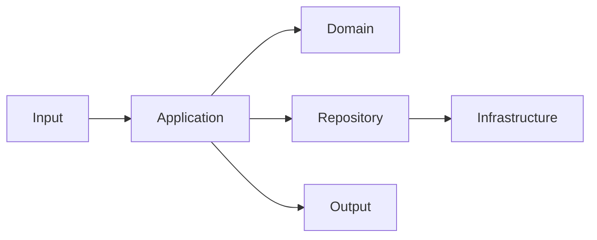

# 技术方案

> 目标：开发者读完本文应能理解事情背景、关键取舍、代码结构与核心伪代码，并据此形成开发计划。API、数据、日志、回滚等内容均服务于整体方案，不要求拆成彼此孤立的一级标题。

> 裁剪规则：小需求可省略不适用的图、API、数据迁移、外部集成或发布内容，但必须标记“不适用”及原因。涉及代码逻辑时，“核心代码逻辑与伪代码”必填；纯配置改动应给出配置差异和生效路径。

## 1. 背景、目标与预期价值

### 1.1 事情背景与问题

- **业务触发与现状**：
- **目标用户/调用方**：
- **要解决的核心问题**：
- **非目标**：

### 1.2 业务价值与技术价值

| 维度 | 预期价值 | 可观察指标或验收方式 |
|---|---|---|
| 业务价值 |  |  |
| 技术价值 |  |  |
| 约束 |  |  |

## 2. 调研、推演与核心矛盾

### 2.1 已确认事实、假设与待决问题

| 类型 | 内容 | 来源 | 对方案的影响 |
|---|---|---|---|
| 已确认 |  | `SRC-###` |  |
| 假设 |  |  |  |
| 待决 |  | `Q-###` |  |

### 2.2 核心问题、矛盾与方案选择

| 问题或矛盾 | 可选方案 | 本次选择 | 选择依据与代价 |
|---|---|---|---|
|  |  |  |  |

## 3. 整体技术方案

### 3.1 架构与职责边界

用架构图和职责表说明本次真正涉及的模块与依赖方向；不要为了形式绘制无关全景图。若用户提供的 DDD 规范或现有仓库明确将 `client`、`domain`、`application`、`infrastructure`、`adaptor`、`start` 等定义为 Maven/Gradle 模块，必须采用“聚合父工程 + 独立子模块”的结构；不得为了省事将它们降级为同一 module 下的 package。新建项目默认以 `<项目名>-` 作为子模块目录和 artifactId 前缀，例如 `<项目名>-domain`；已有仓库命名优先。模块内再按业务与职责分包。



| 模块/层 | 本次职责 | 禁止或限制 | 关键输入/输出 |
|---|---|---|---|
|  |  |  |  |

> 对多模块项目，补充根聚合工程、每个子模块的构建坐标和编译期依赖方向；`start` 仅负责启动与装配，业务实现不反向依赖它。

### 3.2 核心流程、时序与模型

按实际复杂度选择流程图、时序图、模型表或文字调用链。至少表达：入口、关键分支、状态读写、外部调用和返回结果。

| 类型 | 名称 | 关键字段/行为 | 边界与约束 |
|---|---|---|---|
| 聚合/实体/值对象 |  |  |  |
| 命令/查询/视图 |  |  |  |
| 仓储/外部契约 |  |  |  |

### 3.3 核心代码逻辑与伪代码（必填）

每条关键路径按“入口 → 应用编排 → 领域规则 → 基础设施或外部调用 → 返回与观测”写出伪代码。不得只列类名或只贴流程图。

```java
Result<Response> handle(Request request) {
    // 1. 组装应用命令。
    Command command = inputAssembler.toCommand(request);
    // 2. 调用并处理标准失败，不能嵌套为一行调用。
    Result<ApplicationResult> applicationResult = application.action(command);
    if (!applicationResult.success()) {
        return Result.failure(applicationResult.code(), applicationResult.message());
    }
    // 3. 仅转换应用结果为外部响应。
    Response response = inputAssembler.toResponse(applicationResult.data());
    return Result.success(response);
}

Result<ApplicationResult> action(Command command) {
    // 当前方案必须填出参数组装、领域/外部调用、关键分支和结果转换。
    // 此处是伪代码填写提示，不是可以照抄的空实现。
}
```

### 3.4 API、外部调用、可靠性与观测（按需）

| 维度 | 本次设计 | 验收或证据 |
|---|---|---|
| API/事件/外部契约 |  |  |
| 事务、幂等、并发与异常 |  |  |
| 鉴权、数据范围与敏感信息 |  |  |
| 日志、指标、追踪与告警 |  |  |
| 性能、容量与缓存 |  |  |
| 兼容、迁移、发布与回滚 |  |  |

### 3.5 验证路径

| 验证层级 | 关键验证 | 最小证据 |
|---|---|---|
| 开发自测 |  | 命令、结果与关键用例 |
| 代码审查 |  | CR 结论与修复记录 |
| 独立测试 |  | 测试用例和测试报告 |

### 3.6 开发计划（默认嵌入）

按依赖拆出可直接执行的任务；技术获批后可按计划直接编码，不再强制生成另一份计划文档。任务状态在开发交付记录中更新，此处保留计划基线。

| 任务 | 关联需求/设计 | 模块与文件/参考链路 | 依赖 | 实现结果与生产适配 | 自测方法 |
|---|---|---|---|---|---|
| TASK-### | | | | | |

涉及 Java DDD 时，明确使用的随包参考文件、命名替换和不可直接复制的演示设置。确需专项计划时，此处保留唯一位置的链接和拆分理由。

## 4. 事项边界与交付清单

| 事项 | 交付物 | 完成定义 | 不在本事项内的内容 |
|---|---|---|---|
|  |  |  |  |

| ID | 依赖、风险或待决事项 | 影响 | 所需决定/材料 | 截止点 |
|---|---|---|---|---|
| `Q-###` |  |  |  |  |

## 5. 方案反思与可行性推演

> 整份技术草案生成后填写，交付确认前完成。围绕实际相关的架构、依赖、数据、关键链路、并发/幂等、失败恢复、安全隔离、资源、迁移/回滚与验证逐项推演；小改动可用段落。不适用项说明原因。发现矛盾先修正文及关联契约/任务，再重新推演，不能仅增加问题清单。

### 5.1 关键场景与反例

| 场景/假设与关联设计 | 正常或失败/并发推演 | 发现与影响 | 修订位置与重新推演结果 | 证据类型/来源 |
|---|---|---|---|---|
| | | | | 逻辑推演 / 已执行实验 / 待验证 |

### 5.2 当前可行性结论与剩余条件

说明当前可行范围、尚未闭环的阻断项、未验证假设及必要的验证任务/通过条件。不能用建表成功、版本可下载或模板齐全替代端到端证据；本节不等于开发自测、CR、独立测试或生产就绪结论。

排期由当事人依据实际情况决定，默认不生成工时/人天估算；显式要求估算时说明依据与不确定性。

---

### 决策与变更记录

| 版本 | 时间 | 变化 | 原因 |
|---|---|---|---|
| 0.1 |  | 初始方案。 |  |
